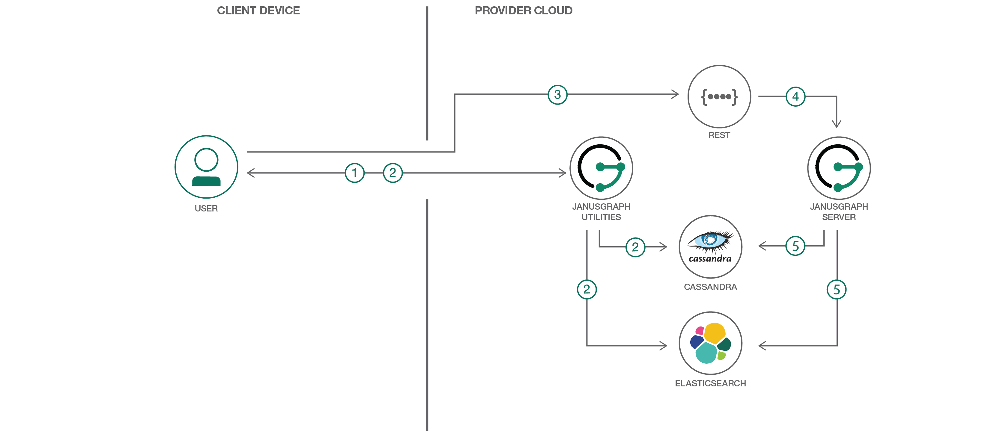
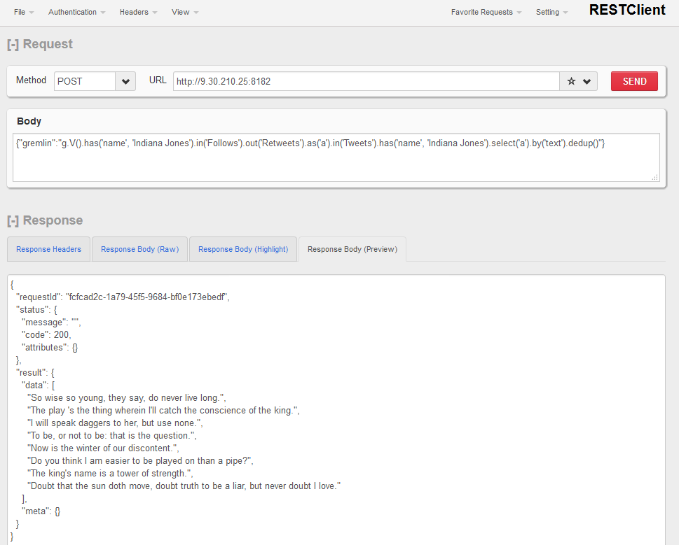

[](https://travis-ci.org/IBM/janusgraph-utils)

# Develop a graph database app using JanusGraph

This Code Pattern contains sample data and code for running a Twitter-like application in JanusGraph. The utility code illustrates how to use OLTP APIs to define schema, ingest data, and query graph. Developers can use or modify the code to build and operate their custom graph applications, or create similar java and groovy files to interact with JanusGraph.

When the reader has completed this Code Pattern, they will understand how to:
* Generate a synthetic graph dataset
* Load a graph schema from json
* Import graph data in csv files into JanusGraph database
* Query and update graph data using Console and REST API
* Setup and configure a distributed JanusGraph system



## Flow
Prerequisites:
Install and configure JanusGraph, Cassandra, ElasticSearch, janusgraph-utils

1. The user generates Twitter sample schema and data using JanusGraph utilities
2. The user loads schema and imports data in backend servers using JanusGraph utilities
3. The user makes search and update requests in a REST/custom client
4. The client app sends the REST requests to JanusGraph server
5. The JanusGraph server interacts with backend to process and return graph data

## Included components

* [Apache Cassandra](https://cassandra.apache.org/): An open source, scalable, high availability database.
* [JanusGraph](http://janusgraph.org/): A highly scalable graph database optimized for storing and querying large graphs. JanusGraph v0.1.1 was used for this code pattern development and test.

## Featured technologies
* [Databases](https://en.wikipedia.org/wiki/IBM_Information_Management_System#.22Full_Function.22_databases): Repository for storing and managing collections of data.
* [Java](https://java.com/en/): A secure, object-oriented programming language for creating applications.

# Watch the Video

[](https://www.youtube.com/watch?v=1TQcPWgPvF8)

# Steps
## Run locally
1. [Install prerequisites](#1-install-prerequisites)
2. [Clone the repo](#2-clone-the-repo)
3. [Generate the graph sample](#3-generate-the-graph-sample)
4. [Load schema and import data](#4-load-schema-and-import-data)
5. [Run interactive remote queries](#5-run-interactive-remote-queries)

### 1. Install prerequisites
> NOTE: These prerequisites can be installed on one server. The instructions are written for Cassandra 3.10 and ElasticSearch 5.3.0 on Linux. Newer versions should work, but might not have been tested. The folder structures on Mac can be different. Check Cassandra and ElasticSearch official documentations for details.

Install Cassandra 3.10 on the storage server. Make the following changes in `/etc/cassandra/cassandra.yaml` and restart Cassandra.

```
start_rpc: true
rpc_address: 0.0.0.0
rpc_port: 9160
broadcast_rpc_address: x.x.x.x (your storage server ip)
```

Install ElasticSearch 5.3.0 on the index server. Make the following changes in `/etc/elasticsearch/elasticsearch.yml` and restart ElasticSearch.

```
network.host: x.x.x.x (your index server ip)
```

Install JanusGraph on the graph server:
* Install java (1.8), maven (3.3.9, newer should work), git (2.7.5, newer should work)
* Run `git clone https://github.com/JanusGraph/janusgraph.git`
* Run the following commands in the `janusgraph` folder:
```
git checkout 4609b6731a01116e96e554140b37ad589f0ae0ca
mvn clean install -DskipTests=true
cp conf/janusgraph-cassandra-es.properties conf/janusgraph-cql-es.properties
```
* Make the following changes in conf/janusgraph-cql-es.properties:
```
storage.backend=cql
storage.hostname=x.x.x.x (your storage server ip)
index.search.hostname=x.x.x.x (your index server ip)
```

Install a REST client, such as RESTClient add-on for Firefox, on the client machine.

### 2. Clone the repo

Clone the `janusgraph-utils` on the graph server and run `mvn package`.

```
git clone https://github.com/IBM/janusgraph-utils.git
cd janusgraph-utils/
mvn package
```

### 3. Generate the graph sample

Run the command in `janusgraph-utils` folder to generate data into `/tmp` folder.
```
./run.sh gencsv csv-conf/twitter-like-w-date.json /tmp
```
Modify the generated user file under `/tmp` so the sample queries will return with data.
```
sed -i -e '2s/.*/1,Indiana Jones/' /tmp/User.csv
```
### 4. Load schema and import data

A graph schema can be loaded from either the Gremlin console or a java utility. You can check the
doc [doc/users_guide.md](doc/users_guide.md) for details. Alternatively, just run one command in `janusgraph-utils` folder to
load schema and import data.
```
export JANUSGRAPH_HOME=~/janusgraph
./run.sh import ~/janusgraph/conf/janusgraph-cql-es.properties /tmp /tmp/schema.json /tmp/datamapper.json
```

### 5. Run interactive remote queries

Configure JanusGraph server by running these commands:

```
cd ~/janusgraph/conf/gremlin-server
cp ~/janusgraph-utils/samples/date-helper.groovy ../../scripts
cp ../janusgraph-cql-es.properties janusgraph-cql-es-server.properties
cp gremlin-server.yaml rest-gremlin-server.yaml
```

Add this line to janusgraph-cql-es-server.properties:
```
gremlin.graph=org.janusgraph.core.JanusGraphFactory
```

Change the following four lines in rest-gremlin-server.yaml:
```
host: x.x.x.x (your server ip)
channelizer: org.apache.tinkerpop.gremlin.server.channel.HttpChannelizer
graph: conf/gremlin-server/janusgraph-cql-es-server.properties}
scripts: [scripts/empty-sample.groovy,scripts/date-helper.groovy]}}
```

Start JanusGraph server:
```
cd ~/janusgraph; ./bin/gremlin-server.sh ./conf/gremlin-server/rest-gremlin-server.yaml
```

Now you can query and update graph data using REST. For example, send REST requests using RESTClient
in browser with following:
```
Method: POST
URL: http://x.x.x.x:8182
Body: {"gremlin":“query_to_run"}
```
You can find sample search and insert queries in [samples/twitter-like-queries.txt](samples/twitter-like-queries.txt).

# Sample output



# Links
* [Demo on Youtube](https://www.youtube.com/watch?v=1TQcPWgPvF8): Watch the video.
* [JanusGraph](https://docs.janusgraph.org/): Learn more about this highly scalable graph database optimized for storing and querying large graphs distributed across a multi-machine cluster.
* [Data and Analytics Reference Architecture](https://www.ibm.com/cloud/garage/architectures/dataAnalyticsArchitecture): Learn how this Journey fits into the Data and Analytics Reference Architecture

# Learn more

* **Data Analytics Code Patterns**: Enjoyed this Code Pattern? Check out our other [Data Analytics Code Patterns](https://developer.ibm.com/technologies/data-science/)
* **AI and Data Code Pattern Playlist**: Bookmark our [playlist](https://www.youtube.com/playlist?list=PLzUbsvIyrNfknNewObx5N7uGZ5FKH0Fde) with all of our Code Pattern videos
* **JanusGraph Performance Evaluation:** [On-boarding with JanusGraph Performance](https://www.slideshare.net/ChinHuang4/onboarding-with-janusgraph-performance).

# License
This code pattern is licensed under the Apache Software License, Version 2.  Separate third party code objects invoked within this code pattern are licensed by their respective providers pursuant to their own separate licenses. Contributions are subject to the [Developer Certificate of Origin, Version 1.1 (DCO)](https://developercertificate.org/) and the [Apache Software License, Version 2](https://www.apache.org/licenses/LICENSE-2.0.txt).

[Apache Software License (ASL) FAQ](https://www.apache.org/foundation/license-faq.html#WhatDoesItMEAN)
